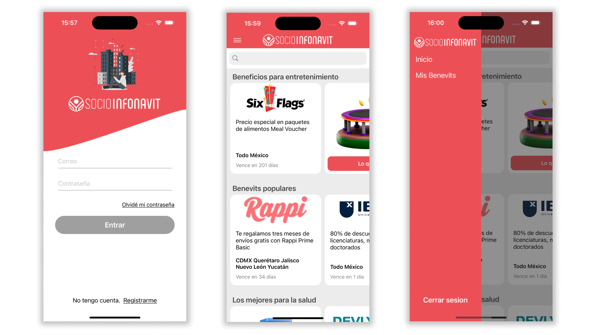

# Portfolio
Edgar's portfolio.

## Chatbot (module)
Chatbot created specifically as an extra module of the main application, focused on helping the user with sports related questions.

**Technologies:** SwiftUI, MVVM and URLSession.

Video: https://youtu.be/2WGuF41h7VY

## Socio Infonavit (challenge)
Technical test.

**Technologies:** UIKit programmatically (No Storyboard).

Video: https://youtu.be/oziIHvRQgVw

## Spoke
Application focused on safe driving where an alert will pop up when a car that has the possibility of crashing approaches the user at a high speed, allowing the user to be aware.

**Technologies:** UIKit (iOS 13), Storyboard, MVVM, API REST, CoreLocation, Gyroscope, RxSwift, SPM, URLSession and Mapbox.

## Appciona Oficial
Application focused to show news, restaurants, hotels and routes to promote tourism in Cortegana located in Spain.

**Technologies:** SwiftUI 3, Firebase, MVVM, SPM and WebKit.
  
Video: https://youtu.be/ujJSzjiJhgk

## TMarket
Final thesis project.

**Technologies:** SwiftUI 3, Firebase, Facebook API, Google API and SPM.

Video: https://youtu.be/HuamEErUohY

## RiderPath
Application originally intended for motorcyclists, creating routes to ride (Cancelled, UI only).

**Technologies:** SwiftUI 3 and MVVM.

Video: https://youtu.be/iEOkN34OWDs

## RealEstate App
Aplicacion para bienes raices. (Cancelada, solo UI)

**Technologies:** SwiftUI 3.

## FavMovies (Challenge)
Application created to pass a technical test.

**Technologies:** SwiftUI 3.

