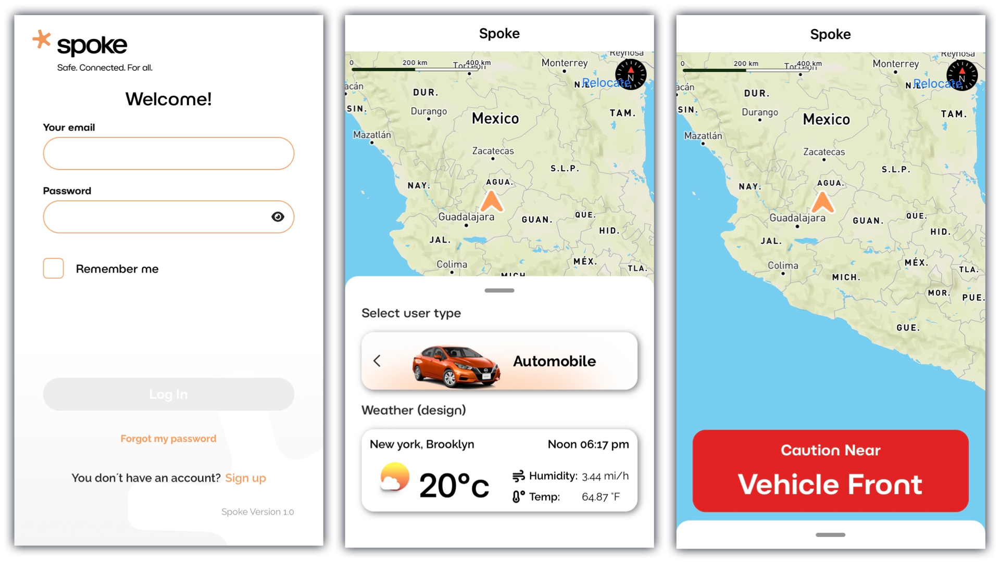
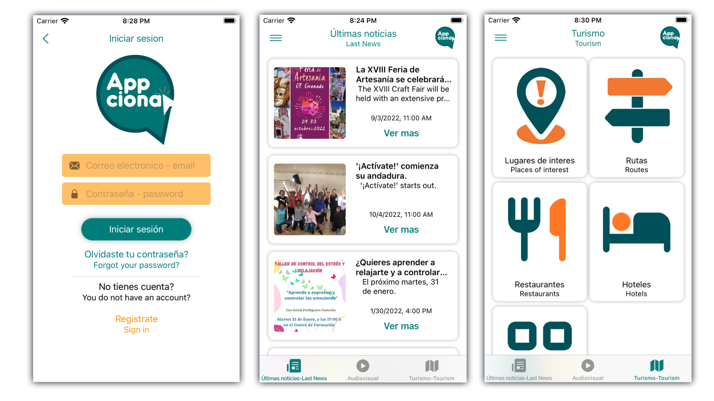
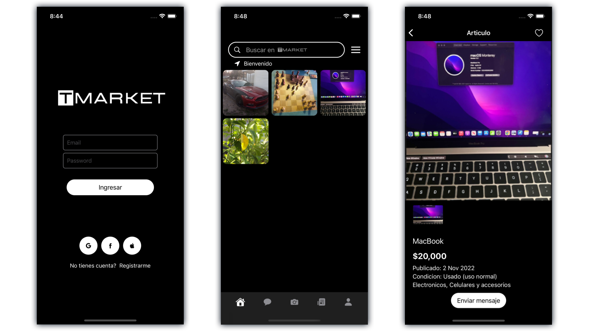
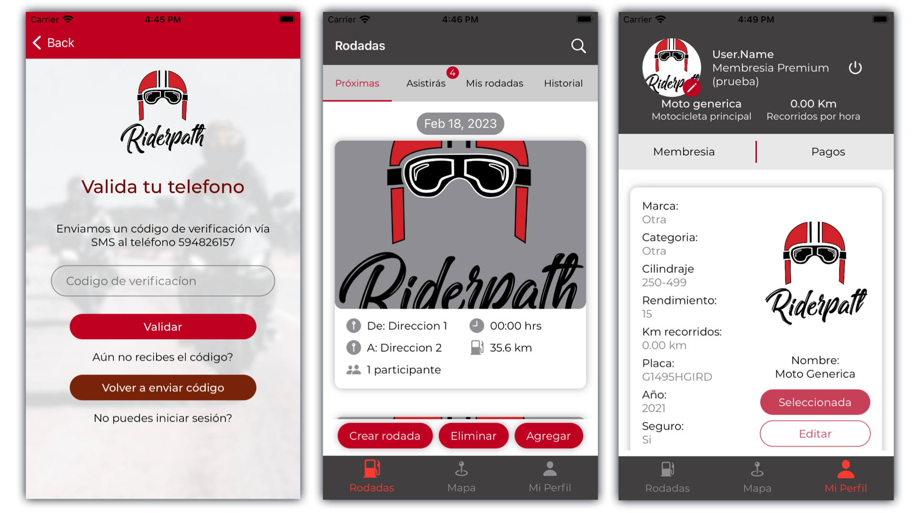
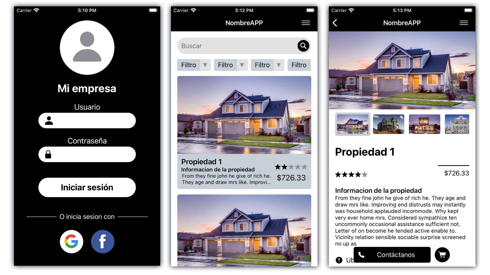
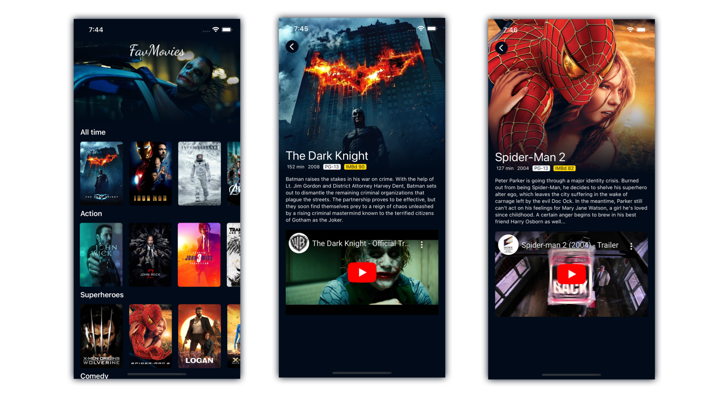

# Portfolio
Edgar's portfolio.

## Spoke
> Technologies
- UIKit (iOS 13)
- MVVM
- API REST
- Mapbox

## Appciona Oficial
> Technologies
- SwiftUI 3
- MVVM
- Firebase

Video: https://youtu.be/ujJSzjiJhgk

## TMarket
> Technologies
- SwiftUI 3
- MVVM
- Firebase
- Facebook API
- Google API
- Swift Package Manager

Video: https://youtu.be/HuamEErUohY

## RiderPath
> Technologies
- SwiftUI 3
- MVVM

Video: https://youtu.be/iEOkN34OWDs

## RealEstate App
> Technologies
- SwiftUI 3

## FavMovies
> Technologies
- SwiftUI 3
- MVC

